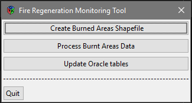
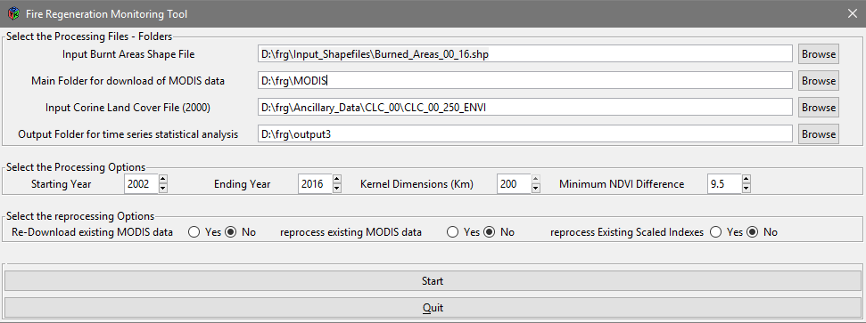

<!-- README.md is generated from README.Rmd. Please edit that file -->
[](https://travis-ci.org/lbusett/frgtool)

frgtool
=======

Allows analysis of post-fire vegetation regeneration from time series of summertime MODIS data

Installation
------------

You can install frgtool from github with:

``` r
# install.packages("devtools")
devtools::install_github("lbusett/frgtool")
```

Running the tool
----------------

To run frgtool use:

``` r
frg_main()
```

when prompted, specify the path to **python.exe linked to your ARCGIS installation** (use "/" for path separator !).

Then use the GUI to proceed.



1.  Create Burned areas shapefile --&gt; Used to create the Burnt Areas shapefile starting from EFFIS oracle tables (should work automatically);

2.  Process Burnt Areas Data --&gt; Used to process burnt areas data to extract time series of MODIS data and perform statistical analysis in order to compute the number of years needed for recovery;



Set the correct paths and press "Start". Then wait (a while...) for processing to end

1.  Update Oracle Tables --&gt; Update oracle tables using results of the processing
