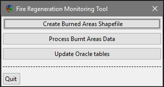
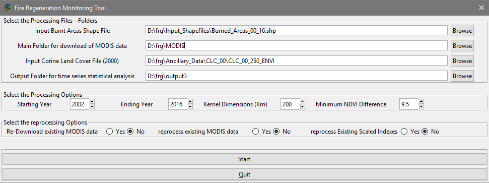

# frgtool

Allows analysis of post-fire vegetation regeneration from time series of summertime MODIS data

## Installation

You can install frgtool from github with:

```{r gh-installation, eval = FALSE}
# install.packages("devtools")
devtools::install_github("lbusett/frgtool")
```

## Running the tool

To run frgtool use:

```{r example, eval=FALSE}
frg_main()
```

when prompted, specify the path to __python.exe linked to your ARCGIS installation__
(use "/" for path separator !). 

Then use the GUI to proceed. 



1. Create Burned areas shapefile --> Used to create the Burnt Areas shapefile
  starting from EFFIS oracle tables (should work automatically);
  
2. Process Burnt Areas Data --> Used to process burnt areas data to extract time
  series of MODIS data and perform statistical analysis in order to compute the 
  number of years needed for recovery; 
  
  

Set the correct paths and press "Start". Then wait (a while...) for processing
to end
  
3. Update Oracle Tables --> Update oracle tables using results of the processing
